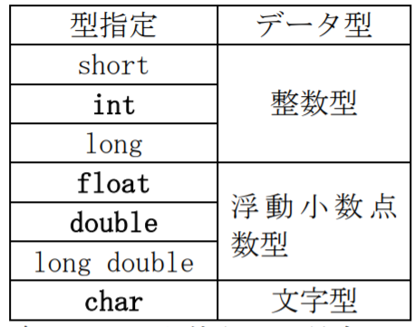

# 変数

### 変数とは


このようによくたとえられているのが箱です

データを格納して使うものです

変数には必ず型というものがあり、型というのは大きさと種類を表しています

## 型



このようにいろいろな型があります

```
#include<stdio.h>
int main() {
    int a = 10;
    printf("%d", a);
    return 0;
}
```

実行結果

```
10
```

- `int a = 10`

int型の変数aを宣言し、数値10を代入している

- `printf("%d", a)`

%dはエスケープシーケンスといい、10進数を表示するという意味を持っています