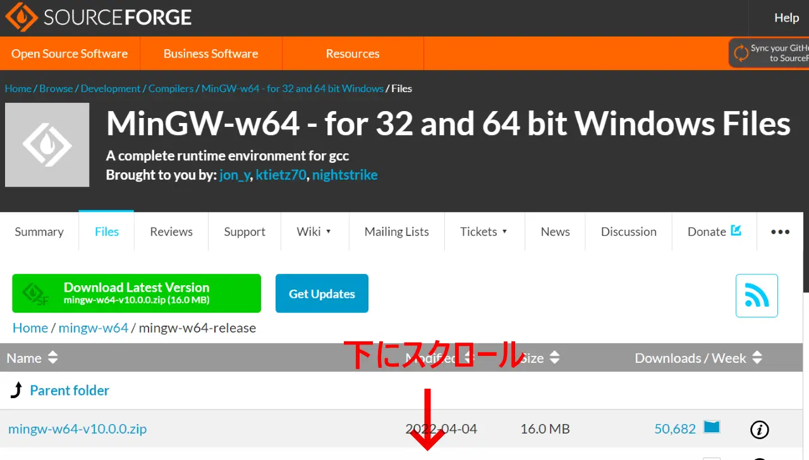

# C言語プログラミング

## 開発環境

- Visual Stadio Code (エディタ)
- gcc compiler (コンパイラー)

## 環境構築

- Visual Studio Codeを[ダウンロード](https://code.visualstudio.com/)
- GCCを[ダウンロード](https://www.mingw-w64.org/downloads/)

### GCCダウンロード手順

1\. ここをクリック

2\. ダウンロードしたインストーラーをダブルクリック

3\. インストール手順

アーキテクチャを**x86_64**にする

インストールするフォルダーをこのように変更する

Nextを押してインストール完了

### GCCがインストールできたら

1\. 環境変数を変更する

新規をクリックし

`C:\Program Files\mingw-w64\bin`

コピペして**OK**をクリックして環境変数の設定は完了

### コマンドプロンプトで確認

1\. コマンドプロンプトを起動

2\. `gcc -v`と打つ

3\. 正しく表示されたら完了